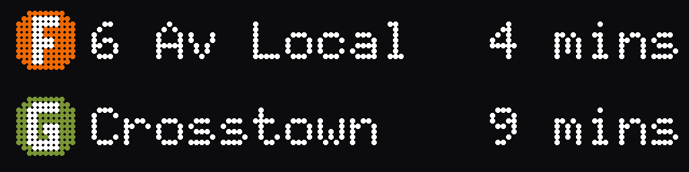

# LED Matrix Train Display




Real-time NYC subway arrivals (F/G at 7th Avenue, Brooklyn) on a 128x32 RGB
LED matrix driven by a Raspberry Pi — with a pixel-accurate ANSI terminal
simulator so you can run the exact same board on any machine, no hardware
required.

## Try it in 30 seconds

```bash
git clone https://github.com/dvd-rsnw/matrix-controller.git && cd matrix-controller
python3 -m venv .venv && source .venv/bin/activate
pip install -e .
python3 -m matrix_controller --demo
```

You'll see synthetic F/G arrivals animate in your terminal exactly as they'd
appear on the physical panel; the hero image above is a still frame rendered
by this same code via `scripts/render_hero_image.py`. Press Ctrl-C to stop.

## How it works

Each poll cycle pulls arrivals from a source, lays them out on a pixel
buffer, and pushes that buffer to whichever driver is active:

```
source (API | demo) -> TrainArrival -> TrainBoard -> PixelBuffer -> driver (hardware | terminal)
```

The board owns its own BDF bitmap-font rasterizer (no image libraries
required at runtime), and its layout is covered by golden-frame snapshot
tests so visual regressions show up as a diff, not a screenshot review.
Drivers are intentionally dumb: they just take a finished `PixelBuffer` and
either write it to the LED panel or print it as ANSI blocks — all the
interesting logic lives upstream of them.

```
src/matrix_controller/
├── app.py         # wires config, source, driver, and board into the poll loop
├── canvas.py      # PixelBuffer — all drawing goes through it
├── config.py      # env-var settings (see Configuration below)
├── fonts.py       # BDF font rasterizer
├── models.py      # TrainArrival
├── profiles.py    # per-Pi-model matrix tuning presets
├── drivers/       # terminal (ANSI) and hardware (rgbmatrix) outputs
├── rendering/     # shapes, text, palette, and the TrainBoard layout
└── sources/       # http (real API) and demo (synthetic) data
```

## Running it on real hardware

### Parts

- Raspberry Pi 3B+, 4, or Zero 2 W — **not** Pi 5, which is unsupported by
  [rpi-rgb-led-matrix](https://github.com/hzeller/rpi-rgb-led-matrix) (different GPIO block)
- HUB75 RGB LED matrix panel(s)
- Adafruit RGB Matrix Bonnet (or compatible HUB75 driver hardware)
- A 5V power supply sized for your panel — LED panels draw several amps at
  full brightness; see `docs/hardware-tuning.md` for sizing guidance

### Quick start on the Pi

```bash
git clone https://github.com/dvd-rsnw/matrix-controller.git && cd matrix-controller
scripts/setup.sh
```

`scripts/setup.sh` installs Docker, prompts for your `.env` (or leaves it
empty for demo mode), builds the image, starts the container, and offers to
install a systemd unit so the board comes back up on reboot. Afterwards,
manage it with `scripts/run.sh {start|stop|restart|status|logs}`.

### Bare-metal alternative

If you'd rather not use Docker:

```bash
pip install -e ".[hardware]"
sudo python3 -m matrix_controller
```

`sudo` is required because driving the GPIO pins needs root. The `[hardware]`
extra builds and installs the `rgbmatrix` Python bindings from source — see
the License section below.

## Configuration

All configuration is environment variables, loaded from the process
environment or a `.env` file in the repo root (see `.env.example`, which you
can copy to `.env` and adjust). Every value is optional — with no `.env` at
all, the board runs in demo mode on the terminal.

| Variable | Default | Meaning |
|---|---|---|
| `TRAIN_API_URL` | unset | Your train API endpoint (see `docs/api-contract.md`). Unset means demo data. |
| `POLLING_INTERVAL` | `15` | Seconds between polls of the API. Must be > 0. |
| `MATRIX_SOURCE` | `auto` | `auto` \| `api` \| `demo`. `auto` picks `api` if `TRAIN_API_URL` is set, else `demo`. |
| `MATRIX_DRIVER` | `auto` | `auto` \| `hardware` \| `terminal`. `auto` picks `hardware` if the `rgbmatrix` package is importable, else `terminal`. |
| `MATRIX_HARDWARE_PROFILE` | `auto` | `auto` \| `pi-zero-2w` \| `pi-3` \| `pi-4`. `auto` detects your Pi model; see `docs/hardware-tuning.md`. |
| `MATRIX_BRIGHTNESS` | profile default | Overrides the profile's brightness. Range 1–100 (percent). |
| `MATRIX_GPIO_SLOWDOWN` | profile default | Overrides the profile's GPIO pacing. Range 0–10. |
| `MATRIX_PWM_BITS` | profile default | Overrides the profile's PWM color depth. Range 1–11. |
| `MATRIX_PWM_LSB_NANOSECONDS` | profile default | Overrides the profile's base PWM pulse width. Range 50–3000. |
| `MATRIX_REFRESH_RATE_LIMIT` | profile default | Overrides the profile's refresh-rate cap, in Hz. Must be ≥ 1. |

The five `MATRIX_*` tuning variables (`MATRIX_BRIGHTNESS` through
`MATRIX_REFRESH_RATE_LIMIT`) are single-value overrides layered on top of
whichever hardware profile is resolved — they only matter on real hardware.
See `docs/hardware-tuning.md` for what each one does, starting values per Pi
model, and a troubleshooting table for flicker, ghosting, and thermal
issues.

## Bring your own data

The board renders whatever its source hands it — the demo source generates
synthetic F/G arrivals, and the HTTP source polls any backend that serves
the JSON shape described in `docs/api-contract.md`. There's no coupling to
MTA APIs, GTFS, or any particular transit agency baked into the rendering
code; point `TRAIN_API_URL` at your own endpoint and it works. Demo mode
exists precisely so this repo is useful standalone, with no backend of your
own required.

## Hardware tuning

Getting a crisp, flicker-free image out of a HUB75 panel means balancing
GPIO timing, PWM depth, refresh rate, and power delivery for your specific
Pi and panel. `docs/hardware-tuning.md` covers all of it: what each
`MATRIX_*` variable does, starting profiles per Pi model, and a
symptom-to-fix troubleshooting table.

If you're an AI coding agent working in this repo, it also ships as a skill
(`.claude/skills/matrix-hardware-tuning/SKILL.md`) — `AGENTS.md` is the
entry point for agent-facing documentation generally.

## Development

```bash
pip install -e ".[dev]"
python3 -m pytest
ruff check . && ruff format .
mypy
```

Board layout is covered by golden-frame snapshot tests: frames render to
ASCII art and are compared byte-for-byte against files in `tests/golden/`.
After an intentional visual change, regenerate them with
`python3 -m pytest --update-golden`, then **look at the diff** before
committing — an unreviewed golden update is a review reject. CI runs the
same `pytest`, `ruff check`, `ruff format --check`, and `mypy` commands
described above.

## License

This project is licensed under the [MIT License](LICENSE).

The optional `hardware` extra (`pip install -e ".[hardware]"`) builds
[hzeller/rpi-rgb-led-matrix](https://github.com/hzeller/rpi-rgb-led-matrix),
which is licensed GPL-2.0. It is not bundled in this repository and is only
fetched and compiled if you opt into the `hardware` extra (or build the
Docker image, which does the same). Installing or distributing a combined
build that includes it is subject to the terms of the GPL.

The bundled bitmap fonts (`assets/fonts/*.bdf`) are from the classic X11
misc-fixed collection and are public domain.
